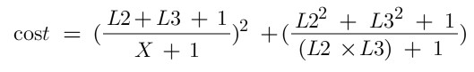
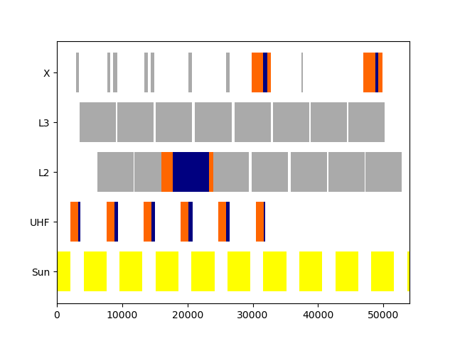
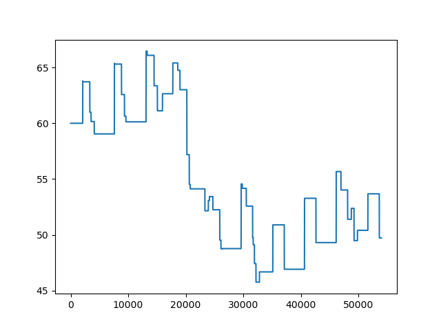
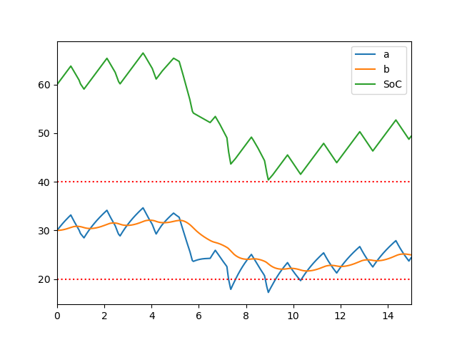
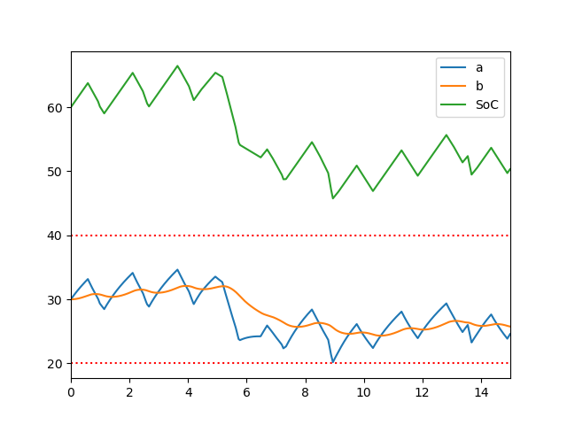

#Model checker
## Model checker’s diagnostic trace format
First print 'Loading model from "<model>.py"... done' if the model was loaded successfully (additional output)
For each property:
  print the time taken to evaluate the property (additional output)
  print property.name ':' True|False if reachability or <cost>|infinity if minimum reward
  print path if True|<cost> (path format = [<state>, <transition>, <state>, <transition>, ..., <state>])
  print empty line (additional output)

## Expected results
property Prop2 = E(true U is_done);
cruising_with_car.py output:

Done in 2.689 seconds
Prop2: True
['(is_off = False, is_on = False, is_done = False, is_cruised = False, i = 0, j = 0, w = 0, Main_location = 0)', 'τ', '(is_off = False, is_on = False, is_done = False, is_cruised = False, i = 1, j = 0, w = 0, Main_location = 3)', 'on', '(is_off = False, is_on = True, is_done = False, is_cruised = False, i = 1, j = 0, w = 0, Main_location = 4)', 'warm_up' 
...
'τ', '(is_off = True, is_on = False, is_done = True, is_cruised = False, i = 100, j = 252, w = 20, Main_location = 1)']

property PropReward = Xmin(S(reward),is_done);
ltswithrewards.py output:

Done in 19.707 seconds
PropReward: 1000002
['(i = 0, j = 0, is_done = False, is_check = False, Main_location = 0)', 'τ', '(i = 1, j = 0, is_done = False, is_check = False, Main_location = 3)', 'inc', '(i = 1, j = 0, is_done = False, is_check = False, Main_location = 0)', 'τ', '(i = 2, j = 1, is_done = False, is_check = False, Main_location = 3)',
...
'done', '(i = 1000000, j = 999999, is_done = True, is_check = Fal
se, Main_location = 2)']

property PropReward1 = Xmin(S(reward),is_done && is_check);
ltswithrewards.py output:

Done in 16.615 seconds
PropReward1: infinite

## Implementation description 
### Reachability-BFS
fucntion named 'checkBFS(prop)' where prop is the current property to check

#### Data structures
We use a set 'visited' to keep track of the visited states, a list 'queue' to keep track of the new states to visit and a dictionary 'parent' which maps the hashed value of the parent to a tuple which contains the child and the transition from parent to child.

Once we reach our goal we loop through all the parent states until we reach the initial state appending the states and transitions to a list 'path' which we then return

The BFS implementation follows the pseudo code in the lecture notes.
## Cost-Dijkstra
fucntion named 'checkCost(prop)' where prop is the current property to check

As recommended by the project manual we use a CostState object that can store the cost and the state.
We use a heap queue 'queue' which stores CostState objects where the cost functions as the priority, a dictionary 'table' which maps the hash of a state to a tuple (parent, minimum_total_cost, transitions) and a set 'visited' to keep track of the visited states so that it is able to recognize newly discovered states to add to 'table' 

Once we reach our goal we loop through all the parent states until we reach the initial state appending the states and transitions to a list 'path' which we then return

The Dijkstra implementation follows the pseudo code in the lecture notes.

## External sources
heapq with example of heapq priority queue
https://docs.python.org/3/library/heapq.html
# Satellite modest model

## Overview 
For the model we created different processes for each of the jobs, the sun and the battery.
In total we have 6 processes, *Sun()*, *Linear_Battery()*, *Lband2()*, *Lband3()*, *Xband()*, *UHF()*.
Unlike Lband jobs the Xband jobs were merged into one process with a single array since the duration do not overlap and there is not much difference.
In the entirety of the model all the time/date values are in seconds where 0 being the start date (2016 March 20 21:00) and the rest being the difference from that time.
A note that has to be made is that our initial state of the battery is 80% while the lower bound is 40%.
Changing the initial state of the battery or the lower bound would change the resulting schedule but would still be correct.

### Battery
Each of the processes has a common action with the Linear_Battery that will signal that a change in the load has taken place.
If at any point the SoC has reached a level that below the given threashhold the Linear Battery will stop and the goal will never be reached.
Moreover, once the clock has reached the gmax it will make a final calculation of the SoC and will go to the goal state.
gmax being the end date - start date, in seconds.

### Jobs
The approach for every job type (xband, lband, uhf) is the same
Every process has its own array containing the start date followed by the end date of every job.
Also, it has an index indicating the next possible value or the end date if it has taken a job.

At the time of the next job minus the preheat/slewing time the process has to make a choice.
Either take the job (and start preheating/slewing) or skip it.
The exception to this is the UHF job which will always have to be taken.
Moreover, since a UHF job can be taken at the same time as an Xband or Lband we do not need to consider whether another type of job is on-going.

For the Lband and Xband type of jobs we have implemented a simple boolean lock which will guarantee that only one out of the Xband or Lband2 or Lband3 jobs run at the same time.
This check was added in the guards of taking an Lband or Xband job by simply checking if lock is false (unlocked).
Once a job starts preheating it will set the lock to true (locked) and back to false (unlocked) once it has cooldowned.

### Sun
For the sun we used the same approach with the difference that there is no preheat, no cooling down and no skipping.
Furthermore when extracting the sun windows from the csv data we also consider 'incomplete windows'. 
Meaning if the start time of the sun was before the our start date, the sun window would start from time 0.
 
## Heuristics

### Assumptions and Abstractions
As for every model we do not want to precicely model every detail but only what is of interest.
This reduces the overall complexity and makes finding a suitable schedule less time consuming.

1. The sun charge is set to 5700mW which is the lower bound.
By taking the worst case scenario we know the battery will not run out.
2. Xband and Lband jobs will always require (10+20) slewing plus warmup time and need to fully cooldown.
Instead of optimizing the movement of the satellite when it changes attitude we have opted to simplify it by assuming the worst case.
3. As per one of the requirements the satellite only takes a job if it fills the entire job window.

### Job balance and Cost function
One of the requirements is to keep a good balance between different jobs
Firstly we need to keep a balance between Xband and Lband jobs, ensuring the satellite does not take too many Lband jobs and run out of memory.
Achieving this was done by having a ratio that will be added to the guards of taking and Lband or Xband job.
We have a variable named R which will keep track of our ratio.
Whenever we take an Lband job we increment R by 2 and whenever we take an Xband job we decrement by 1.
The different values are used to indicate that we would prefer two Xbands for every Lband.

In order to take an Xband we have a guard R > 0.
This ensures that we can only take an Xband if we have taken an Lband before (have data to downlink).
On the other hand, to take an Lband we have a guard R < 4.
This guard will ensure that we cannot take too many Lband jobs in a row while having some breathing space for different combinations of Lband and Xband jobs.

Furthermore, we would like to keep the memory usage (Lband-Xband ratio) low and keep a balance between Lband2 and Lband3.
To achieve this we have a cost function that adds cost whenever we take an Lband job.

(((l2_count+l3_count+1)/(x_count+1))*((l2_count+l3_count+1)/(x_count+1)))+(((l2_count*l2_count)+(l3_count*l3_count)+1)/((l2_count*l3_count)+1))
where l2_count, l3_count, x_count are the number of times we have taken an Lband2, Lband3, Xband jobs respectively.
To visualise the equation see 'cost.png'

The cost function can be simplified to Cost() = (Lband-Xband ratio)^2 + (Lband2-Lband2 ratio)
The worse the balance of Lband-Xband and Lband2-Lband3 the higher the cost.
The first part of the Cost function is raised to the power of 2 to give more weight to keeping a good balance between Xband-Lband.

For skipping a job we decided to hardcode it as a cost of 5.
We unsuccessfully tried to have the cost of skipping a job as the inverse of the previously mentioned cost function.

## Schedule produced
To confirm the performance of our model we made a checker that will check the lowest cost property and create a graph presenting the picked schedule and the battery charge.

The schedule can be seen in the jobs_picked.png file with the orange box indicating the preheat+slewing and cooldown time, the gray box the jobs not scheduled and the blue box the scheduled jobs.

The schedule produced is safe, good and non-trivial.
It is safe since we do not exceed the lower bound of 40% of the max capacity of the battery.
Good because it keeps a good balance between Lband2, Lband3 and Xband jobs while making sure to always take every UHF job.
Lastly, it is non-trivial since it takes jobs and not skipping all of them

The battery SoC precentage throughout the duration of the schedule can be seen in the charge.png file

# Kinetic battery

## Supplementary files
For the third part a number of supplementary files are privided.

### Helper files
- _schedule.pkl_ is several python lists stored as a pickle file. Made by checker.py (min reward function), used by schedule.py.
- _schedule.py_ is a python script that uses the schedule.pkl file to load the jobs that were scheduled in the linear battery model.
The script produces the _jobs_picked.png_, _charge.png_ and prints the modest array that will be used in schedule.modest to confirm the schedule.
- _run_scheduler.sh_ is a bash script which runs all the commands from start to finish. 
First a prompt ([y/N]) will appear to check if the user wants to export model.modest to the python file and run the checker on the file. 
Then a python script is run (_schedule.py_) to make a graph out of the scheduled jobs.
Then from these scheduled jobs the ``modest modes`` command is done to export the trace using the kinetic battery.
Lastly, from the result of the trace a graph is made (_schedule.png_) to show the SoC of the kinetic battery.
This is made to automate the process of changing the values of the possible jobs to producing a schedule and verifying the result.
However, gmax still needs to be updated manually.
- _schedule.csv_ consists of trace of ``modest modes`` and is used by _graph.py_ which produces the _schedule.png_ file.
- _graph.py_ is a python script that uses the schedule.csv file to generate the final graph of a, b and SoC, named _schedule.png_. Furthermore, when this graph finishes it will display in stdout whether well 'a' has dipped below the safe threshold or not.

### Images
- _schedule.png_ is the graph showing the SoC throughout the duration of the schedule as well as the *a* and *b* values
- _schedule_fst_attempt.png_ is the graph showing the SoC, *a* and *b* of the first attempt with the kinetic battery.
- _charge.png_ is the graph showing the SoC in the linear battery model, created by schedule.py 
- _jobs_picked.png_ is the graph showing which jobs are taken as well as the sun, created by schedule.py

## Kinetic battery
For this part we replaced the linear battery of the seconds part with the kinetic battery provided on canvas.
Furthermore, the arrays were changed to only the scheduled jobs from the model with the linear battery.
For this reason the skip actions were all removed from each process since we do not skip any of the scheduled jobs.
A few more variables were removed since they were not necessary/used (e.g. lock, cost).
Lastly, we updated the rate of change of the battery to the correct values (background_load + lband2_load + ...).

To get the scheduled jobs from part two, we had to modify the checker.
When the path from the minimum reward function returned it would check which jobs were scheduled and store it as an array in the form of a pickle list.
This was done by checking certain boolean values that we added to our model which indicate whether a jobs is ongoing.
Then running the _schedule.py_ file it would print in stdout the scheduled jobs as a modest array.

## Attempts
For the first attempt the checker did not produce a safe schedule.
This is because while the SoC did not go below the 40% threshold, well 'a' did (20%) as can be seen below.

To fix this issue we decided the change the lower threshhold of the linear battery model to 45%.
This extra 5% would ensure that the linear battery model is more conservative and the kinetic battery does not go below the threshhold.
This indeed fixed the issue and in the final schedule well 'a' does not go below the given threshold.

## Final remarks
To test checker.py, model.modest and schedule.modest in one go you can run _run_schedule.sh_.
This will should take no more than 20 mins.
To produce a schedule of a different duration, the variable 'gmax' has to be changed in both 'schedule.modest' and 'model.modest' files, where gmax is the number of hours in seconds.
While this will produce a correct schedule the graphs generated will also have to be modified to display the correct values.
For the graphs the matplotlib library was used therefore it will be required installing the dependancies in _requirements.txt_ file.
